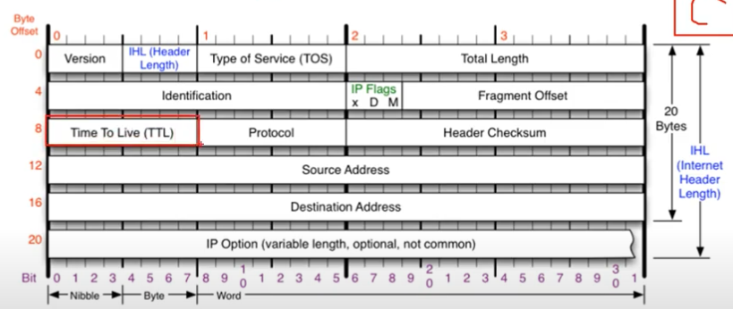

### [IPv4 프로토콜](https://youtu.be/_i8O_o2ozlE?list=PL0d8NnikouEWcF1jJueLdjRIC4HsUlULi)

- 하는일
    
    네트워크 상에서 데이터를 교환하기 위한 프로토콜, **데이터가 정확하게 전달될 것을 보장하지 않음**.
    
    중복된 패킷을 전달하거나 패킷의 순서를 잘못 전달할 가능성 있음 (악의적으로 이용시 DoS 공격)
    
    → 데이터의 정확하고 순차적인 전달은 그 상위 프로토콜인 TCP 에서 보장
    
- 구조
    
    
    
    - Version : 무조건 4가 온다, 6 이 오는 경우 없음 ipv6 는 구조 자체가 다름
    - IHL: 헤더의 길이, 최소 20 byte ~ 60 byte 근데 4비트로 표현(0~15)하기 위해 /4 를 해준다. 16진수로
    - TOS : 0 써준다. 옛날거라 안씀, 중요한 데이터임을 나타낸다
    - Total length : 뒤에 페이로드까지 합친 길이, 상위계층부터 인캡슐레이션한 전체의 길이
    - Identification + IP Flags  + Fragment Offset : 한세트, 데이터가 쪼개졌을때 알아볼 수 있는 값
    - TTL : 패킷이 살아있는 시간(숫자) 장비 넘어갈때마다 -1이 된다. N → 0 이 되는 순간 패킷 죽음, 운영체제마다 다름 윈도우 128, 리눅스 64
    - Protocol : 상위 프로토콜 타입 알려줌 icmp = 01 tcp = 06 udp = 17
    - header checksum: 헤더의 오류 확인

### [ICMP 프로토콜](https://youtu.be/JaBCIUsFE74?list=PL0d8NnikouEWcF1jJueLdjRIC4HsUlULi)

- 하는일
    
    Internet Control Message Protocol, 인터넷 제어 메시지 프로토콜
    
    네트워크 컴퓨터 위에서 돌아가는 운영체제에서 **오류 메시지**를 전송받는데 주로 쓰임
    
    프로토콜 구조의 Type 과 Code 를 통해 오류 메시지를 전송 받는다.
    
- 구조
    
    
    
    - type : 카테고리, 대분류
        - 0 echo Reply : 응답
        - 3 Destination Unreachable : 오류, 목적지 도달 못함, 중간에 경로 잘못
        - 5 Redirect : 라우팅 테이블을 원격지에서 수정, 남에것 수정 가능
        - 8 Echo.  : 요청
        - 11 Time Exceded : 오류, 목적지 갔지만 응답x, 상대방 방화벽
    - code : 소분류

### [라우팅 테이블](https://youtu.be/CjnKNIyREHA?list=PL0d8NnikouEWcF1jJueLdjRIC4HsUlULi)

`netstat -r`   으로 확인가능

어디로 보내야 하는지 설정되어 있음. 지도 역할, 라우팅 테이블 없으면 찾아갈 수 없다. 그래서 0.0.0.0 인 특수한 ip 로 기본 경로를 설정해줌

### 라우팅 테이블 및 전송과정: 다른 네트워크와 통신 과정

1. A가 본인의 라우팅 테이블 확인, B의 네트워크 대역이 본인의 라우팅 테이블에 있어야 갈 수 있음.
2. 프로토콜 작성 Eth|IPv4|ICMP 요청(8) 
    1. Eth mac 주소 cccccccccccc (게이트웨이의 맥주소)
3. 공유기가 라우팅 테이블을 확인하고 목적지까지 갈 수 있게 옆네트워크로 향하도록 이더넷 프로토콜을 다시 만듦
4. 네트워크 대역이 바뀔때마다 이더넷 프로토콜 다시 만듦(초록 → 보라)
5. 상대 공유기가 b 컴퓨터로 이더넷 프로토콜 다시 mac 주소 bbbbbb 됨
6. 받았다고 0 버전으로 A 컴퓨터로 보내기 위에것 반복

→ 맥주소 모르면 arp 추가로 해야함

### [IPv4 조각화 이론](https://youtu.be/_AONcID7Sc8?list=PL0d8NnikouEWcF1jJueLdjRIC4HsUlULi)

큰 IP 패킷들이 적은 MTU(Maximum Transmisssion Unit)를 갖는 링크를 통해 전송되려면 여러개의 작은 패킷으롤 쪼개어 전송돼야한다.

→ 목적지까지 패킷을 전달하는 과정에 통과하는 **각 라우터마다 전송에 적합한 프레임으로 변환이 필요**

조각화가 되면 최종 목적지에 도달할 때까지 재조립되지 않는 것이 일반적. 

IPv4 에서는 **발신지 뿐만 아니라 중간 라우터**에도 IP 조각화 가능

IPv6 에서는 IP 단편화가 **발신지**에서만 가능

재조립은 항상 최종 수신지에서만 가능

- IPv4 의 조각화란
    - ipv4 protocol 인 20 byte(헤더길이) 를 제외하고 조각화
    
    
    
    MF : 1 뒤에 더 있는지
    
    OFFset : 첫번째는 0, 다음은 += 위의 데이터 / 8
    
    DATA
    

### [IPv4 조각화 실습](https://youtu.be/QKEL9aBgHtg?list=PL0d8NnikouEWcF1jJueLdjRIC4HsUlULi)

- 실습
    - 보내려는 데이터 크기: 4618
    - MTU : 1370
        - 몇개의 패킷으로 쪼개지는지? 4개
        - 첫번째 패킷의 데이터 크기? 1350
        - 마지막 패킷의 데이터 크기? 568